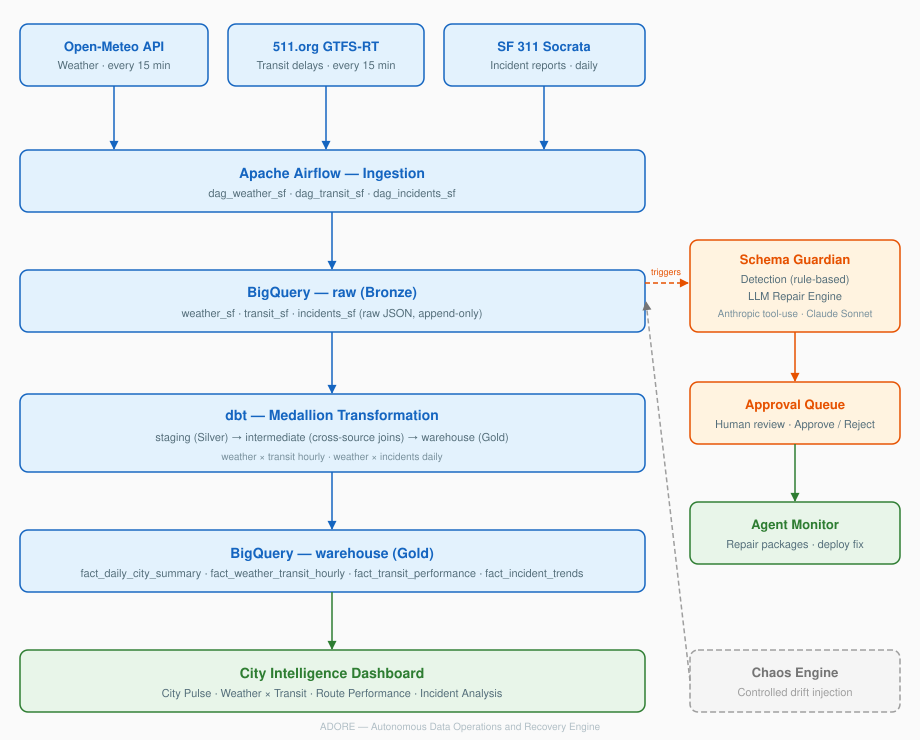

# ADORE — Autonomous Data Operations and Recovery Engine

A live data pipeline with an AI agent that detects upstream schema drift, traces downstream impact through dbt lineage, generates validated SQL fixes, and presents complete repair packages for human approval — reducing the diagnostic workflow from hours to minutes.

---

## The Problem

When an external API changes its response structure — a field renamed, a type changed, a key removed — every downstream dbt model breaks. A data engineer gets paged, manually investigates the source, traces which models and dashboards are affected, writes the fix, tests it, and deploys. That diagnostic loop takes hours.

dbt tests tell you *something broke*. They don't tell you *what changed upstream*, *what's affected downstream*, or *how to fix it*.

ADORE's Schema Guardian agent handles that entire response layer autonomously.

---

## How the Agent Works

```
External API changes schema
         │
         ▼
┌─────────────────────┐
│   Rule-Based Check  │  Compare JSON fingerprint against stored baseline.
│   (no LLM, fast)    │  Cost: zero. Runs on every ingestion cycle.
└────────┬────────────┘
         │ drift detected
         ▼
┌─────────────────────┐
│   Impact Analysis   │  Parse dbt manifest.json → trace full downstream
│                     │  dependency tree → map affected dashboards.
└────────┬────────────┘
         │
         ▼
┌─────────────────────┐
│   LLM Repair Engine │  Anthropic tool-use API (Claude Sonnet).
│                     │  Agent calls tools autonomously:
│                     │    • Read broken dbt model SQL
│                     │    • Get schema diff (old vs new)
│                     │    • Fetch sample raw data
│                     │    • Get downstream impact tree
│                     │    • Propose corrected SQL
└────────┬────────────┘
         │
         ▼
┌─────────────────────┐
│   Validation Layer  │  Syntax check (dry run) → Row count comparison
│                     │  → NULL rate analysis → Column verification
└────────┬────────────┘
         │
         ▼
┌─────────────────────┐
│   Repair Package    │  Complete diagnosis presented to engineer:
│   (Human-in-Loop)   │  what changed, what's affected, proposed fix,
│                     │  validation evidence. Approve / Reject.
└────────┬────────────┘
         │ approved
         ▼
┌─────────────────────┐
│   Auto-Deploy       │  Write fix to disk → dbt rebuild →
│                     │  downstream models refreshed automatically.
└─────────────────────┘
```

---

## What the Engineer Sees

When schema drift is detected, the agent presents a complete repair package:

- **What changed**: field renamed, removed, or type changed — with exact paths
- **Downstream impact**: full dependency tree of every affected model and dashboard
- **Data assessment**: whether corrupted data landed during the drift window
- **Proposed SQL fix**: context-aware rewrite (not find-and-replace — the LLM understands the query logic)
- **Validation results**: syntax, row counts, NULL rates, column checks — all green before the engineer even sees it
- **One click**: Approve → fix deployed, dbt rebuilt, pipeline restored

---

## Why This Approach

- **Rule-based detection first, LLM only on exception.** Detection is a dictionary comparison — runs in milliseconds, costs nothing. The LLM is invoked only when drift is found. At scale across hundreds of sources, cost scales with failure rate, not data volume.

- **Human-in-the-loop by design.** The agent investigates and proposes. The engineer reviews and approves. This isn't a limitation — it's how you'd deploy this in production.

- **Chaos engineering for validation.** A Chaos Engine injects controlled schema drift (field renames, removals, additions) to trigger and demonstrate the agent. Same pattern as Netflix Chaos Monkey.

---

## Tech Stack

| Component | Choice |
|-----------|--------|
| Pipeline | Apache Airflow (self-hosted, LocalExecutor) |
| Warehouse | Google BigQuery |
| Transformation | dbt (medallion: raw → staging → intermediate → warehouse) |
| Agent | Anthropic Python SDK (native tool-use API, no LangChain) |
| Dashboard | Streamlit |
| Chaos Testing | Custom injection CLI |
| Language | Python 3.11+ |
| Cloud | GCP |

---

## Data Pipeline

Live San Francisco city data from 3 sources:

| Source | Data | Frequency |
|--------|------|-----------|
| Open-Meteo | Weather (temp, precip, wind, humidity) | Every 15 min |
| 511.org GTFS-RT | Transit delays (per-route, per-stop) | Every 15 min |
| SF 311 Socrata | City incident reports | Daily |

Transformed through a medallion architecture with cross-source analytics:
- **Weather × Transit** (hourly join): "Do delays increase when it rains?"
- **Weather × Incidents** (daily join): "Does severe weather drive complaint volume?"

---

## Architecture



---

## Demo

Demo video coming soon — shows the full loop: chaos injection → schema drift detection → LLM repair with impact analysis → human approval → automated deployment.

---

## Project Structure

```
adore/
├── dags/
│   ├── ingestion/        # 3 source DAGs (weather, transit, incidents)
│   ├── transformation/   # dbt run DAG
│   ├── agents/           # Schema Guardian trigger DAG
│   └── utils/            # BigQuery client, schemas (single source of truth)
├── dbt/
│   └── models/
│       ├── staging/      # JSON parsing, deduplication
│       ├── intermediate/ # Cross-source joins (weather×transit, weather×incidents)
│       └── warehouse/    # Star schema facts + dimensions
├── agents/               # Schema Guardian, repair engine, lineage analyzer
├── dashboards/           # Agent Monitor (approval UI), City Intelligence
├── chaos/                # Controlled failure injection CLI
└── docs/                 # Architecture diagram, demo script
```

---

## How to Run

**Prerequisites:** Docker, Python 3.11+, GCP account with BigQuery

**Clone and configure**
```bash
git clone https://github.com/Vikneshwar-GK/adore-pipeline.git
cp .env.example .env        # Fill in API keys and GCP credentials
```

**Start the pipeline**
```bash
docker compose up -d        # Airflow at localhost:8080
```

**Start dashboards**
```bash
streamlit run dashboards/agent_monitor.py
streamlit run dashboards/city_intelligence.py
```

**Demo the agent**
```bash
python chaos/chaos_mode.py --inject schema_drift --source weather_sf
# Trigger ingestion DAG in Airflow UI → Schema Guardian fires automatically
# → Repair package appears in Agent Monitor → Approve → Fix deployed
```

---

## Key Design Decisions

- **Rule-based detection before LLM** — cost scales with failure rate, not data volume
- **Anthropic tool-use API (native function calling)** — agent decides which tools to call, not a hardcoded sequence
- **Human-in-the-loop** — agent investigates and proposes, engineer approves
- **Chaos engineering for validation** — controlled failure injection, same pattern as Netflix Chaos Monkey
- **COALESCE-based fixes** — handles both old and new schema rows during the transition window
- **dbt lineage for impact analysis** — blast radius traced automatically via manifest.json
